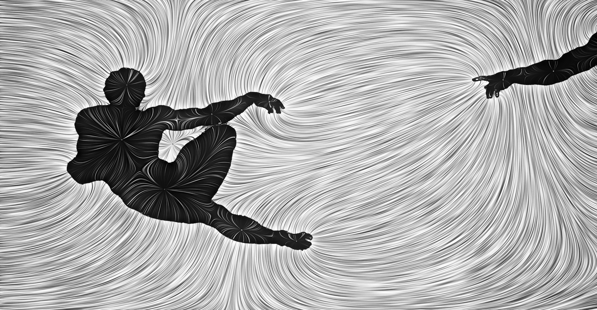
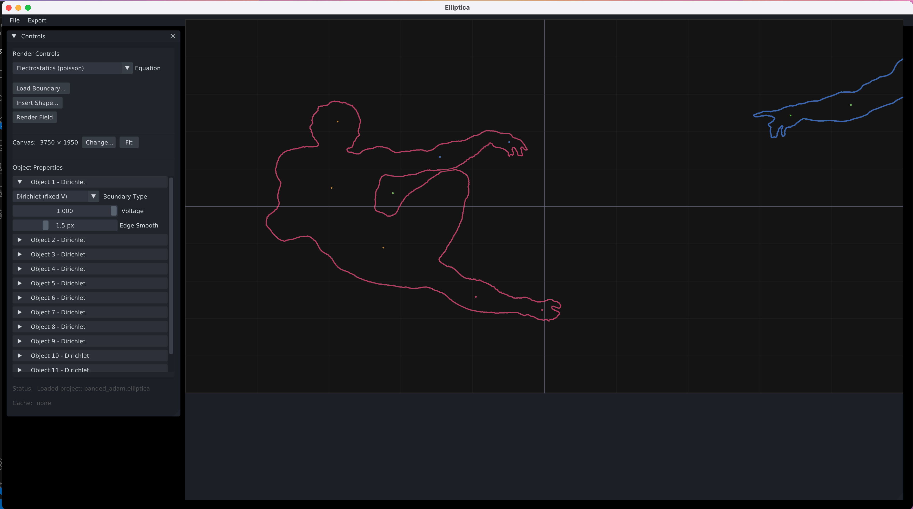
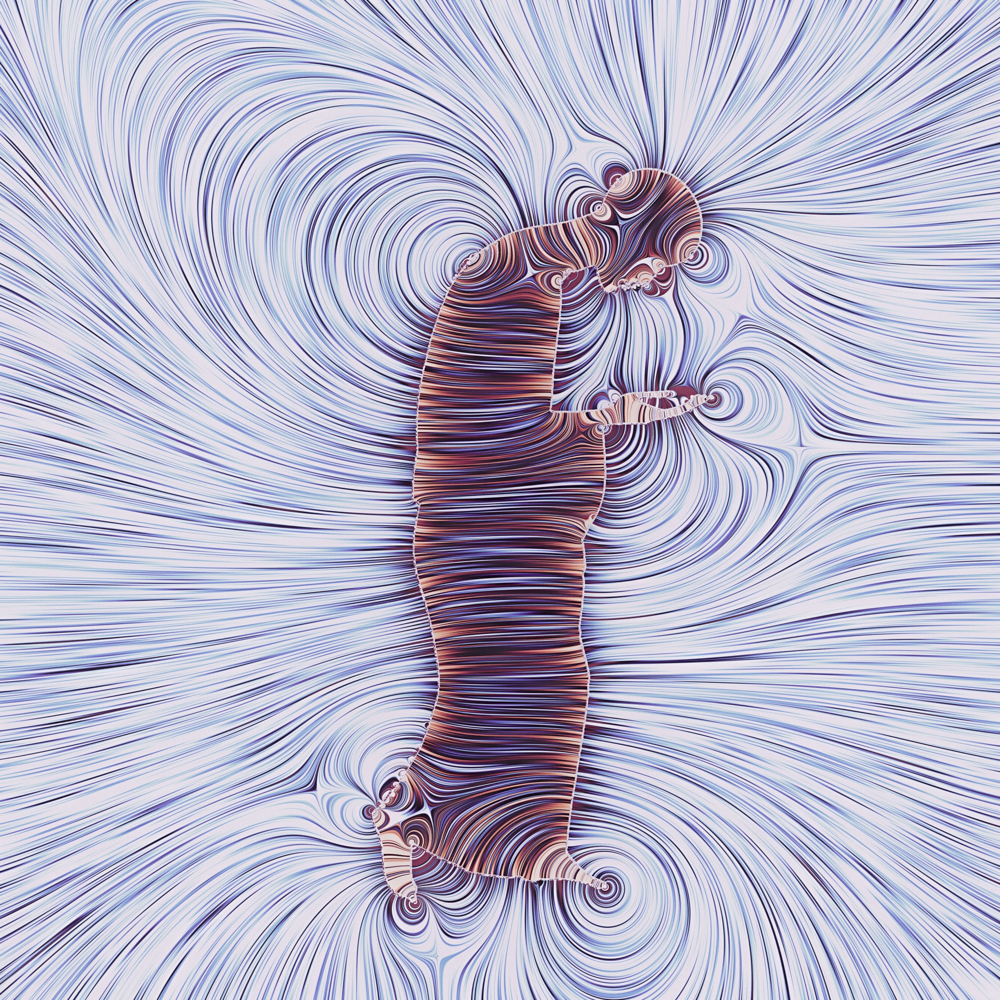

# Elliptica





## What is Elliptica?

Elliptica is a modular framework for making 2d visual arts using elliptic boundary value problems, often in the form of laws of physics.   You place objects on a canvas, impose boundary conditions on them, and then solve a partial differential equation system (like the Poisson equation for electric fields), and visualize the resulting vector fields using high-quality Line Integral Convolution (LIC).

Making good art requires rapid iteration and large amounts of trial and error, so the software is made with this in mind, trying to let you focus on the aesthetic aspects. That said, at 1024 x 1024, expect to have to wait a few seconds per render. Solving PDEs and doing LIC takes a bit of time.

This software is not about trying to give maximally scientifically accurate visualizations of physics, although accurate representation of some aspects of the physics is a side effect. This software is all about making beautiful things. The laws of physics happen to be extremely helpful.

The software contains various useful things that let's you iterate without leaving the software, such as OKLCH color palette creation and postprocessing effects.

The above image is created in Elliptica. So is this one:



## This is an alpha version
This is an alpha version, and I am actively working on this software. Expect bugs, and frequent non-backwards compatible changes. I have so far only tested the software on my own M1 Silicon Mac, although I'm aiming to make this run on other systems. Please reach out if you experience bugs.

The UI is janky right now. I will improve it. 

Note: this project is heavily LLM coded (thanks Claude).  

## Roadmap

Near term

- Faster Poisson solve
- Bug fixes
- UI improvements
- More physics models

Medium term

- Integration of GPU-based LIC 
- Complete rewrite in a different framework that doesn't require unecessary CPU<->GPU roundtrips that hamper performance
- Time-dependence and living images

## Quick Start

```bash
pip install -r requirements.txt
python -m elliptica.ui.dpg
```

## System Requirements

- **Python 3.11+**
- **GPU** (optional): Apple Silicon (MPS) or NVIDIA (CUDA) - falls back to CPU (probably quite slow)

## Installation

```bash
git clone https://github.com/afolkest/elliptica.git
cd elliptica
python3 -m venv venv
source venv/bin/activate  # Windows: venv\Scripts\activate
pip install -r requirements.txt
python -m elliptica.ui.dpg
```

## License

AGPL-3.0. See [LICENSE](LICENSE).
