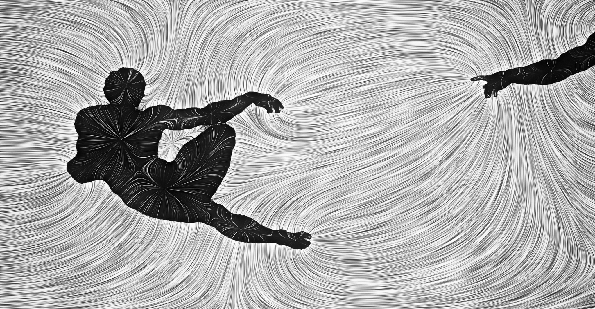
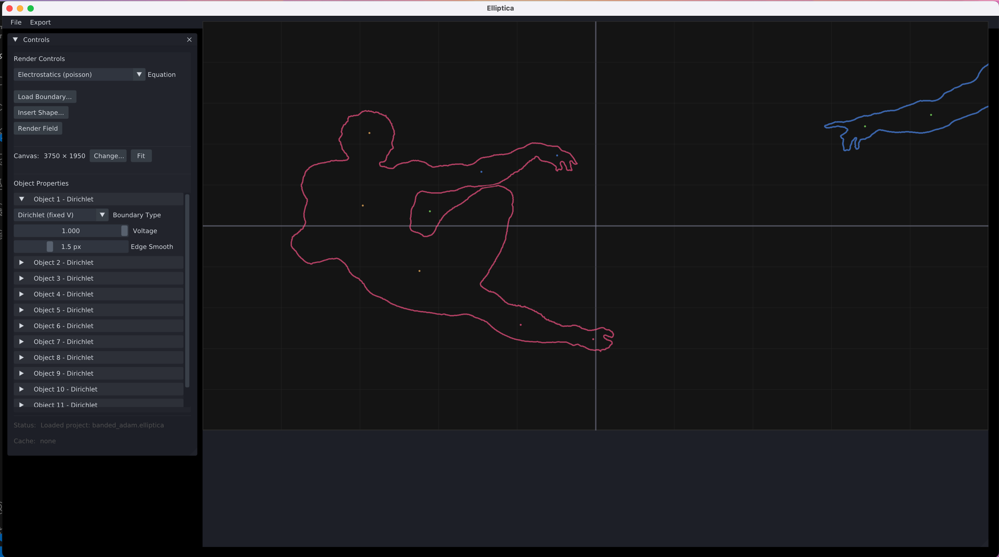

# Elliptica





## What is this?

Elliptica is a program for making 2d visual arts using electrostatics (the Laplace equation).  You place objects on a canvas, impose voltage boundary conditions on them, solve a partial differential equation, and then visualize the resulting vector fields using a technique known as Line Integral Convolution (LIC).

The software contains various useful things that lets you iterate on your pieces without leaving the software, such as OKLCH color palette creation and postprocessing effects.

## This is a prototype: not actively developed, buggy, but fun

This was my first attempt at a larger project 100% coded by LLMs and if you look at the code it shows.

I've moved on to doing a complete low level rewrite in Metal, since the framework choices made here (DearPyGui + PyTorch) are fundamentally incompatible with real time interactivity (given the 
algorithms we're working with here). I will not be adding any more features in the prototype, although I'm open to fix reported bugs. 

## Quick Start

```bash
pip install -r requirements.txt
python -m elliptica.ui.dpg
```

## System Requirements

- **Python 3.11+**
- **GPU** (optional): Apple Silicon (MPS) or NVIDIA (CUDA) - falls back to CPU (probably quite slow)

## Installation

```bash
git clone https://github.com/afolkest/elliptica.git
cd elliptica
python3 -m venv venv
source venv/bin/activate  # Windows: venv\Scripts\activate
pip install -r requirements.txt
python -m elliptica.ui.dpg
```

## License
MIT.

